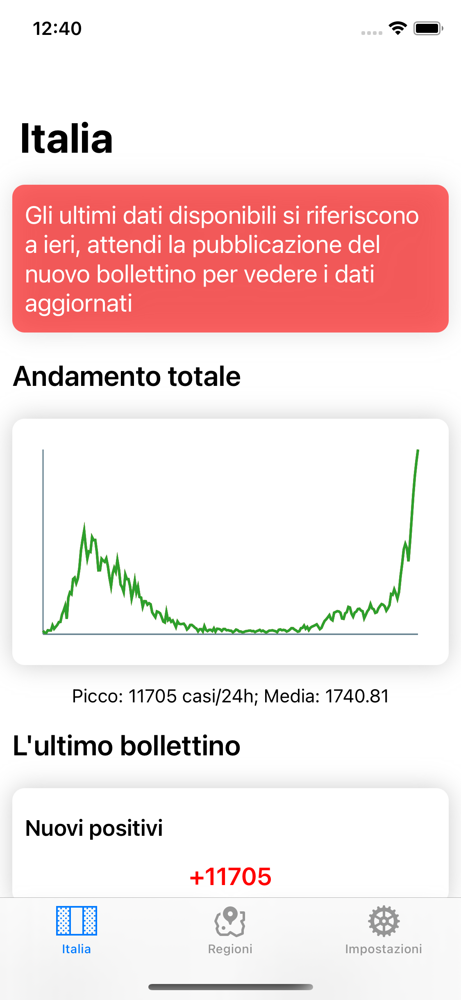
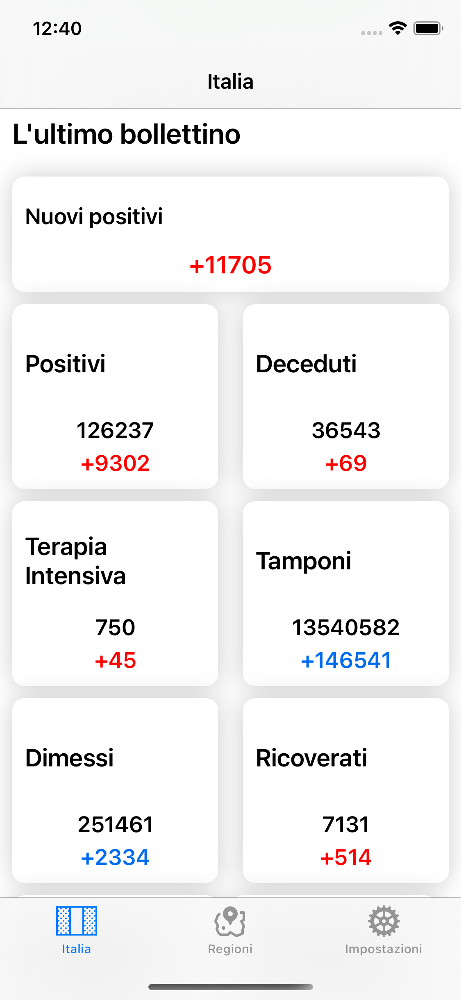
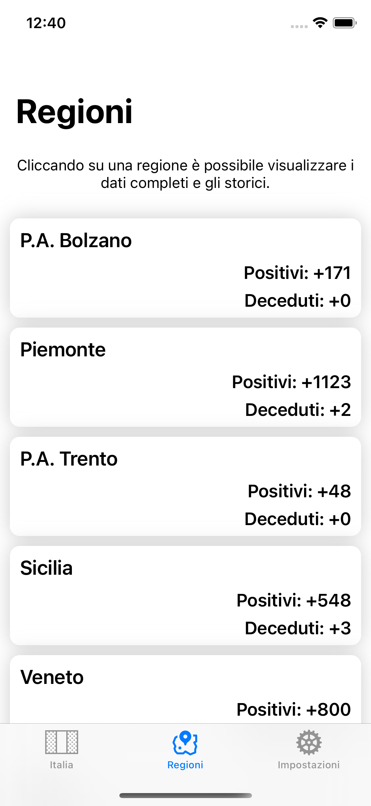

# CovidStatsITA

Applicazione iOS creata allo scopo di visualizzare in maniera rapida e strutturata tutte le informazioni relative al Bollettino emanato giornalmente dalla protezione civile per quanto riguarda l'emergenza Covid-19 in Italia.
I dati sono ottenuti dal repository ufficiale https://github.com/pcm-dpc/COVID-19 utilizzando la versione JSON.

## Funzionalità
Le principali funzionalità sono:
* Bollettino italiano giornaliero
* Bollettino regionale giornaliero
* Nuovi positivi e deceduti per ogni provincia appartenente alla regione
* Grafico riassuntivo dell'andamento dei nuovi positivi italiano e regionale
* Possiblità di visualizzare i dati dei giorni precedenti (italia, regioni e province)

### Screen
<table>
  <tr>
    <td></td>
    <td></td>
    <td></td>
  </tr>
</table>

_Applicazione in continuo aggiornamento_

